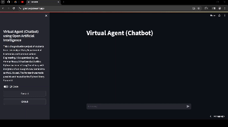

# Virtual agent (chatbot) using open artificial intelligence

This is a graduation project supervised by Lec. Ammar Mousa of students from University of Kufa's department of Electronics & Communications Engineering for the academic year of 2023/2024.



You can visit the website [here](https://grad-proj.streamlit.app/)

## **TL;DR**

This project is based on the power of the Python library LangChain. It is an open source framework used to create AI apps and agents with a varitey of LLM integrations and tools. The LLM chosen for being the most easy to use in our specific case was Cohere. Streamlit was used to make and host the user interface of this application. They had an amazing and easy to use APIs for LLM chatbot cases.

## Usage

You can easily clone these files on your own working folder and use the following commands. The following code is for Windows based systems with [git](https://git-scm.com/downloads) and [Python](https://www.python.org/downloads/) installed.

```bash
git clone https://github.com/muthanii/grad-proj.git
cd ./grad-proj
python -m venv .venv
./venv/Scripts/activate
pip install ./requirements.txt
```

Once everything is done, you can customize the project and change it to your suited needs. You can reference the [LangChain documentation](https://python.langchain.com/docs/get_started/introduction) and the [Streamlit API documentation](https://docs.streamlit.io/library/api-reference) for further references.

## Contact

You can easily contact me for debugging purposes on Telegram [here](https://t.me/muthanii)
